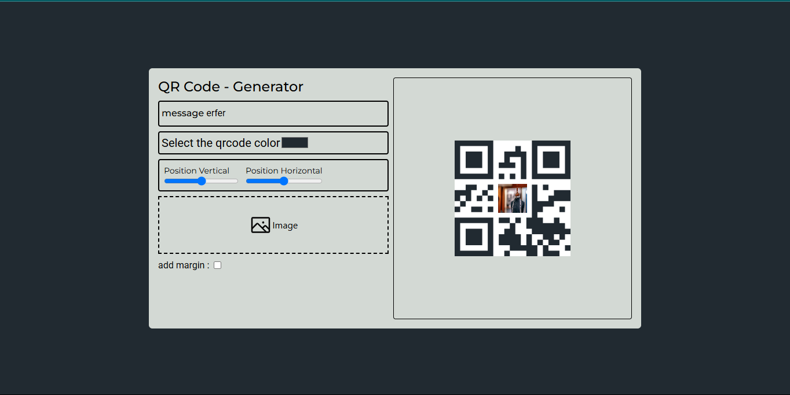

# Customizable qrcode generator

Um simples e moderno aplicativo de gerar codigo qr com possibilidade de adicionar fotos .

 <!-- Se você tiver uma imagem de preview -->


## 🛠️ Tecnologias Utilizadas

- **Frontend:**
  - [React](https://reactjs.org/)
  - [Tailwind CSS](https://tailwindcss.com/) 

## 📦 Instalação

```bash
git clone https://github.com/seu-usuario/customizable-qrcode-generator.git
cd customizable-qrcode-generator
npm install
npm qrcode
